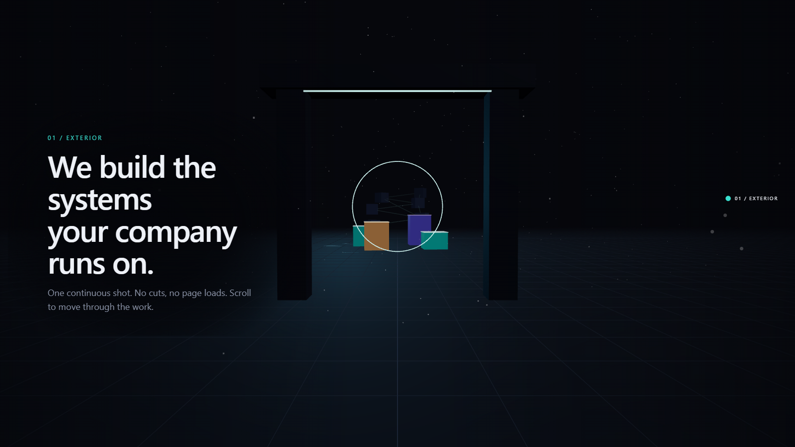
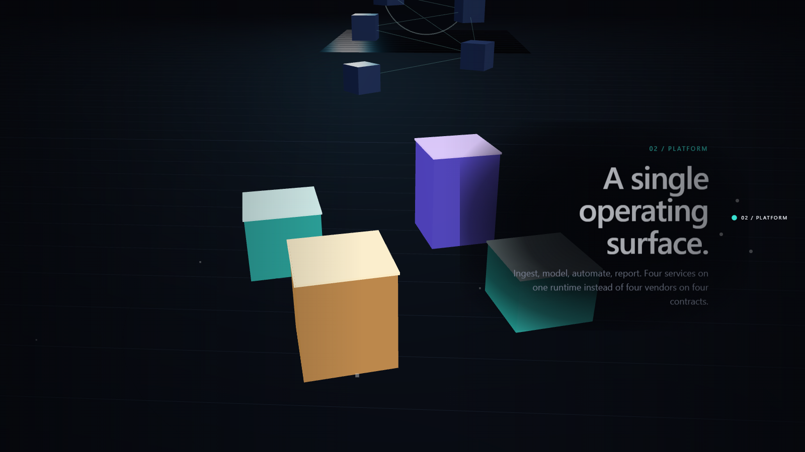
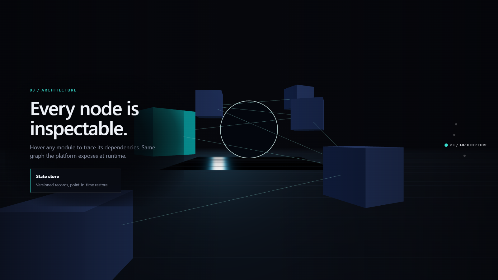
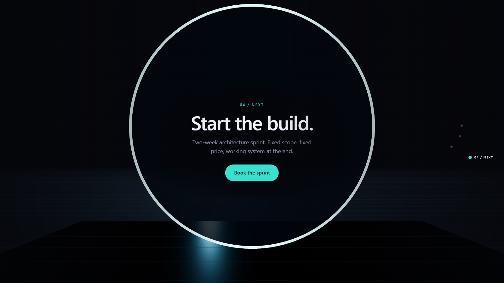
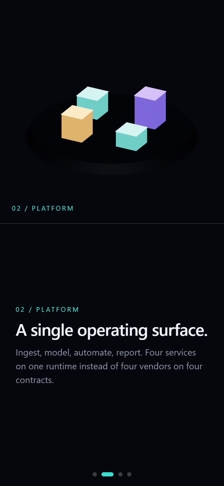

# scroll-world

Single-camera, scroll-driven flythrough landing page. One continuous WebGL shot across four story
nodes on desktop; a fixed isometric viewport with horizontal section snapping under 768px.

**[Live demo →](https://sw7rvy.github.io/scroll-world/)**



```bash
npm install
npm run dev      # http://localhost:5183
npm test         # trajectory regression check
```

## The four beats

One camera, no cuts. Scroll moves it along a single spline through all four.

**02 — Platform.** The camera drops over a diorama of the four services on one runtime.



**03 — Architecture.** The camera flies into the module graph. Hovering any module raycasts against
the `InstancedMesh` and traces its dependencies.



**04 — Next.** The path ends inside the portal, with the copy framed by the ring.



## Architecture

| File | Responsibility |
| --- | --- |
| `src/scroll-world.config.js` | The only file you edit to change the story. Nodes, poses, spans, copy, isometric framings, palette. |
| `src/core/trajectory.js` | Builds the camera spline from node poses and maps scroll progress `0..1` onto it. |
| `src/core/scroll-engine.js` | Lenis wrapper. Owns the single `requestAnimationFrame` loop and the damped progress vector. |
| `src/core/camera-rig.js` | Frame-rate-independent damping of position / look-at / FOV. |
| `src/core/world.js` | Renderer, stage lighting, node assembly, pointer raycasting. |
| `src/core/story-ui.js` | Builds overlay panels and the beacon rail from config; cross-fades them. |
| `src/core/responsive.js` | Mode controller. Tears one mode fully down before mounting the other. |
| `src/core/mobile.js` | Isometric orthographic viewport + horizontal snap rail. |
| `src/nodes/*.js` | Per-node scene content. Each exports `{ group, interactive, update, dispose }`. |

## Node schema

```js
{
  id: 'diorama',
  zone: [0, 0, -70],          // world origin for this node's content
  span: 1.0,                  // share of total scroll length
  hold: 0.46,                 // fraction of the span parked at the pose before travelling on
  ease: 'inOutCubic',
  align: 'right',             // panel placement: left | right | center
  interactive: true,          // opt into pointer raycasting while this node is active
  eyebrow, title, body, cta,
  pose: { position, target, fov },
  via: [{ position, target }],// control points shaping the path to the NEXT node
  iso:  { position, target, zoom }   // mobile isometric framing (position is relative to zone)
}
```

Total page height is derived, not hardcoded: `sum(span) * config.scroll.vhPerSpan` vh, written to
`--track`. Adding a fifth node needs a config entry, a builder in `src/nodes/`, and a line in the
`BUILDERS` map in `world.js` and `mobile.js`.

## Camera trajectory

Node poses plus their `via` control points become two centripetal Catmull-Rom curves — one for
position, one for look-at — so the path is C1-continuous and cannot cusp at node boundaries. Because
a non-closed `CatmullRomCurve3` with `N` points passes exactly through point `i` at `u = i/(N-1)`,
each node's pose is hit exactly rather than approximately.

Scroll progress maps to curve position in two stages: progress → node segment (by `span`), then
local progress → curve `u`, with the first `hold` fraction parked at the node pose so copy has time
to read. FOV is interpolated piecewise across the same boundaries.

`npm test` samples the trajectory at 4000 points and asserts every pose is hit exactly, no camera
teleports between adjacent samples, all four nodes are reachable, and panel opacities never stack.

## Scroll scrubbing

Lenis is the root smooth-scroll engine and the only RAF owner. `ScrollEngine` drives `lenis.raf()`
itself (`autoRaf: false`), reads the animated scroll position, and applies a second exponential
filter on top:

```js
const k = 1 - Math.pow(1 - damping, dt * 60)
```

That form is frame-rate independent, so the feel is identical at 60Hz and 144Hz. A small epsilon
snap collapses the last fraction of the filter to exact equality, which is what removes the residual
sub-pixel dither you otherwise get when a spring never quite settles. Subscribers receive
`(progress, dt)` once per frame — the camera, the overlay, and the beacons all read the same value,
so nothing can desync.

`prefers-reduced-motion` disables both smoothing stages (`lerp: 1`, `damping: 1`); scroll becomes
a direct scrub.

## Mobile fallback

Under 768px the mode controller disposes the flythrough entirely — Lenis, renderer, geometries,
materials, listeners — and mounts a different experience: an orthographic isometric camera pinned in
a fixed stage, with the four sections as a horizontally snapping rail (`scroll-snap-type: x mandatory`,
`scroll-snap-stop: always`). An `IntersectionObserver` on the rail tweens the isometric camera to the
snapped section's `iso` framing over 650ms.

Deep links work in this mode: `#/architecture` opens on that section with the camera already framed.
The hash updates as sections snap.



The stage is pinned and the sections scroll horizontally beneath it, so the world stays on screen
while the copy moves — the closest thing to the desktop flythrough that a phone can afford without
holding a full 3D scene at 60fps.

If WebGL is unavailable at any width, the same fallback mounts with the isometric stage hidden, so
the page degrades to a plain snapping card deck rather than a blank canvas.

## Authoring hook

On desktop, `window.scrollWorld` exposes `{ engine, trajectory, seekNode(i), preview(p), release() }`.
`preview(0.42)` pins the camera at a progress value while art-directing a beat; `release()` hands
control back to scroll.

## Screenshots

The README images are generated, not hand-captured. `scripts/shoot.mjs` drives Playwright through
`window.scrollWorld.preview()`, parks the camera at each node's pose, and writes
`docs/<NN>-<node id>.png`. It reads the node list from `scroll-world.config.js`, so adding a fifth
node adds a fifth screenshot with no edit here.

```bash
npx playwright install chromium   # once
npm run shoot                     # shoots the live site
SHOT_URL=http://localhost:5183/ npm run shoot   # or a local preview build
```

| Variable | Default | Notes |
| --- | --- | --- |
| `SHOT_URL` | the live Pages URL | Any origin serving the built app |
| `SHOT_OUT` | `docs/` | Output directory |
| `SHOT_WIDTH` / `SHOT_HEIGHT` | `1600` / `900` | Width must exceed `config.breakpoint`, or the page mounts the mobile fallback and the hook is absent |
| `SHOT_GPU` | unset | `1` runs headed on the real GPU; leave unset for headless SwiftShader, which renders the ground grid slightly flatter |
| `SHOT_MOBILE_NODE` | `diorama` | Which node the 375x812 mobile shot deep-links to |
| `SHOT_CLOCK` | `6` | Scene time the animations are pinned to before capture |
| `SHOT_DIFF_PEAK` / `SHOT_DIFF_PCT` | `32` / `0.05` | Change-detection thresholds, see below |
| `SHOT_FORCE` | unset | `1` writes every file regardless of the comparison |

### Why re-shooting doesn't churn the repo

A capture is not byte-reproducible even with the scene fully pinned: Chromium's
text antialiasing and its dithering of the panels' radial-gradient scrim differ
between browser sessions. Comparing bytes would rewrite all five PNGs on every
run for changes no one can see.

So the script compares each new frame against the committed one at 1/8 scale,
which averages the high-frequency noise away, and only writes when the result
clears a threshold. Measured on this scene:

| | peak delta | cells over floor |
| --- | --- | --- |
| Session noise, nothing changed | 0–17 | 0.00% |
| Genuine change (`SHOT_CLOCK` 6 → 9) | 61–240 | 0.26–3.35% |

The default peak threshold of 32 sits at the geometric midpoint, roughly 1.9x
clear in both directions. Two rules are checked — peak amplitude and the share
of cells clearing half that peak — because a real change can be loud and local
or quiet and widespread. A no-op re-shoot reports `0 updated` and leaves the
working tree clean.

Nodes marked `interactive` get a pointer sweep first, so node 3 is captured with a module hovered
and its probe card open. If the module layout moves far enough that the sweep misses, the script
warns and still shoots.

After the desktop pass it opens a second 375x812 page to capture the mobile fallback, deep-linking
via `#/<node id>` — that mode has no `scrollWorld` hook, so the hash is the only way to park it on a
given section.

`playwright` is a devDependency for this script alone. The deploy workflow sets
`PLAYWRIGHT_SKIP_BROWSER_DOWNLOAD=1` so CI installs the package without its ~150MB of browsers.

## Deploy

`.github/workflows/deploy.yml` builds and publishes to GitHub Pages on every push to `main`
(or manually via **Actions → Deploy to GitHub Pages → Run workflow**). It runs `npm test` first,
so a broken camera path fails the deploy instead of shipping.

Pages serves a project site under `/<repo>/`, so the workflow passes the path from
`actions/configure-pages` into the build:

```yaml
env:
  VITE_BASE: ${{ steps.pages.outputs.base_path }}
```

`vite.config.js` reads `VITE_BASE` and falls back to `/`, so local dev and preview are unaffected.
To reproduce the deployed build locally:

```bash
VITE_BASE=/scroll-world npm run build && VITE_BASE=/scroll-world npm run preview
# then open http://localhost:5183/scroll-world/
```

## Note on install location

Keep this project outside Windows AppX-virtualized directories (anything under
`AppData\Roaming\<packaged app>\...`). In those locations Node resolves the project root to a
shadow copy under `AppData\Local\Packages\...\LocalCache\`, and Vite's dev server silently falls
back to serving untransformed source — bare imports like `from 'three'` then fail in the browser.
`vite build` and `vite preview` are unaffected. On a normal path (`C:\Users\you\dev\scroll-world`)
`npm install` and `npm run dev` both work with no flags.
